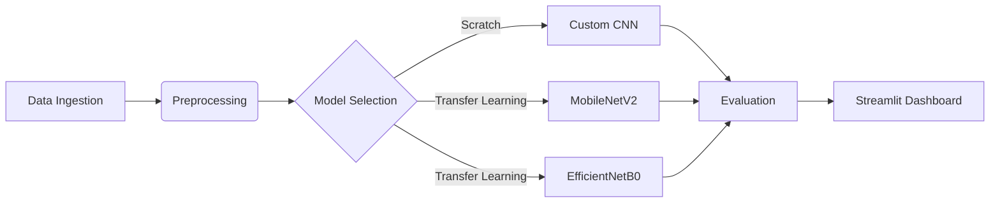
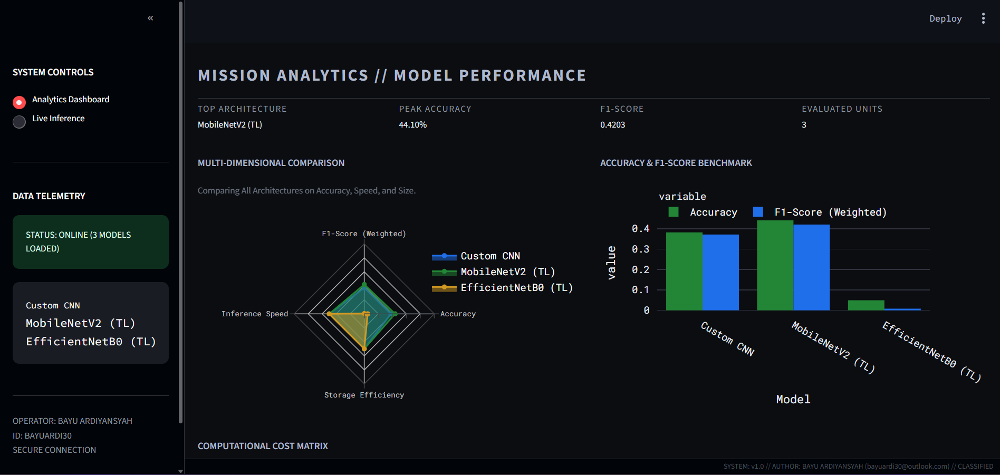
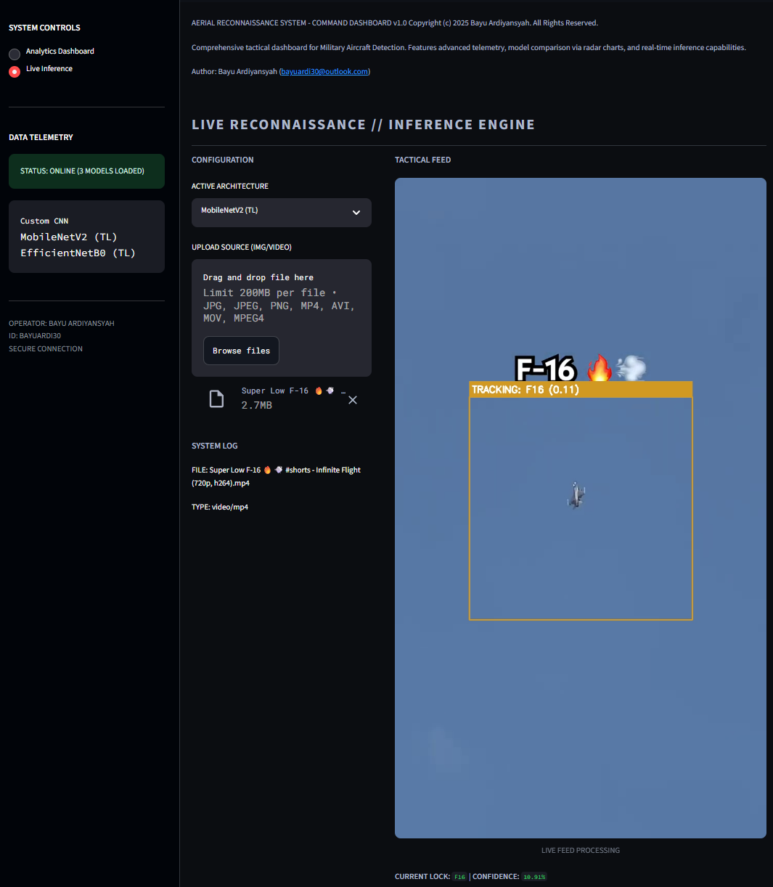
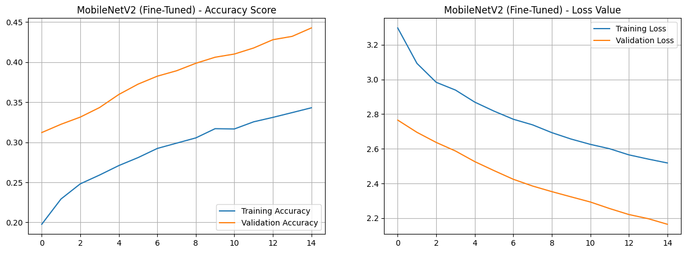
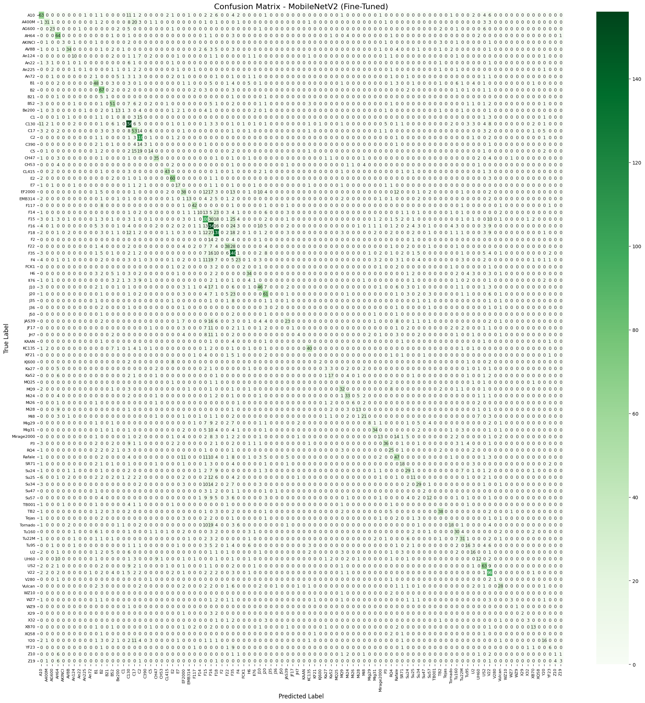
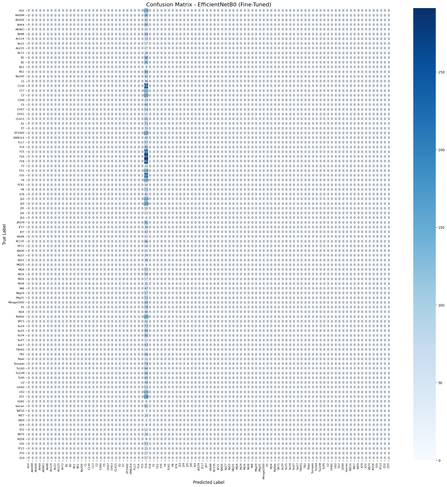

<div align="center">

# ⚔️ ARS: AERIAL RECONNAISSANCE SYSTEM
### *Comparative Framework: Custom CNN vs. MobileNetV2 vs. EfficientNetB0*


-00D4FF?style=for-the-badge&logo=kaggle)


**[Live Deployment](https://huggingface.co/spaces/SlRazer/MLPrak)** • **[Methodology](#-methodology)** • **[Benchmarks](#-comparative-results)** • **[Assessment](#-umm-laboratory-assessment)**

<br>


</div>


## 📖 Project Ontology

**Aerial Reconnaissance System (ARS)** is a computer vision framework engineered to classify military aircraft assets from aerial and ground imagery. In the domain of national defense and airspace surveillance, the ability to rapidly and accurately identify assets is paramount.

This project implements a multi-architecture approach to benchmark the performance of a **Custom Convolutional Neural Network (CNN)** built from scratch against state-of-the-art Transfer Learning architectures (**MobileNetV2** and **EfficientNetB0**). The study focuses on finding the optimal trade-off between classification accuracy, model size, and inference latency for deployment on tactical interfaces.


## 🛠 Methodology

The system adheres to a rigorous End-to-End Machine Learning pipeline, visualized below:



1. **Data Ingestion**: Aggregation of military aircraft imagery (Fighter jets, Bombers, UAVs, Transports).
2. **Preprocessing**: Resizing (224x224), Normalization, and Label Encoding.
3. **Architecture Design**:
    * **Custom CNN**: A heavy 5-layer convolutional network for baseline establishment.
    * **MobileNetV2**: Optimized for speed and low latency (Edge-ready).
    * **EfficientNetB0**: Designed for scaling and feature extraction depth.


4. **Deployment**: Integration into a tactical dashboard using Streamlit with **HUD Simulation**.

---

## ✅ UMM Laboratory Assessment

This project is submitted to fulfill the **Final Practicum Assignment (UAP)** for the Informatics Laboratory at UMM.

| No | Requirement Component   | Project Specification & Implementation                                                                 | Status |
|----|-------------------------|--------------------------------------------------------------------------------------------------------|--------|
| **1.** | **Pemilihan Topik**     | **Data Citra (Image Data)**. Topik: Klasifikasi Pesawat Militer (Aerial Reconnaissance).              | ✅     |
| **2.** | **Pengumpulan Dataset** | Dataset berjumlah **> 15,000 gambar**. Sumber: Kaggle Military Aircraft Dataset & Open Defense Repo. | ✅     |
| **3.** | **Implementasi Model**  | - **Base:** Custom CNN (Non-Pretrained)<br>- **Pretrained 1:** MobileNetV2 (Transfer Learning)<br>- **Pretrained 2:** EfficientNetB0 (Transfer Learning) | ✅     |
| **4.** | **Evaluasi & Analisis** | Evaluasi mencakup Accuracy, F1-Score, Grafik Loss, dan Confusion Matrix. (Lihat bagian [Benchmarks](#-comparative-results)) | ✅     |
| **5.** | **Sistem Website**      | **Streamlit Web App** (Local & Cloud).<br>Fitur: Input Gambar/Video, Real-time Inference, Tactical HUD.<br>🔗 **[Live Demo](hhttps://huggingface.co/spaces/SlRazer/MLPrak)** | ✅     |
| **6.** | **Dokumentasi**         | Repository GitHub terstruktur dengan source code, `.ipynb`, dataset, dan dokumentasi lengkap.        | ✅     |


## 📊 Comparative Results

The following data is extracted directly from the evaluation pipeline.

### 1. Performance & Efficiency Summary

| Architecture | Accuracy | F1-Score (Weighted) | Inference Time (ms) | Model Size (MB) |
| --- | --- | --- | --- | --- |
| **MobileNetV2 (TL)** | **44.10%** | **0.4203** | 5.31 ms | **24.67 MB** |
| **Custom CNN (Base)** | 38.19% | 0.3714 | **4.99 ms** | 299.14 MB |
| **EfficientNetB0 (TL)** | 4.93% | 0.0049 | 5.38 ms | 39.70 MB |

> **🧪 Analysis:**
> * **MobileNetV2** is the optimal choice, achieving the highest accuracy and F1-score with a very compact model size (24 MB), making it suitable for edge deployment.
> * **Custom CNN** shows extremely high storage consumption (~300 MB) despite being a simple architecture, due to the large number of parameters in Dense layers.
> * **EfficientNetB0** experienced convergence failure (Underfitting) in this specific training run, likely due to hyperparameter sensitivity or dataset noise.
> 
> 

### 2. Hardest Classes to Detect

Classes with **0.0 F1-Score**, indicating high confusion or insufficient training samples:

| Model | Top 3 Hardest Classes |
| --- | --- |
| **Custom CNN** | `Su47`, `FCK1`, `XQ58` |
| **MobileNetV2** | `MQ25`, `J50`, `CH53` |
| **EfficientNetB0** | `A10`, `Su34`, `Su25` |


## 💻 Interface & Deployment

The system features a **Tactical Command Dashboard** designed for clarity and situational awareness.

| Analytics Dashboard | Live Inference (Tactical HUD) |
|---------------------|-------------------------------|
| *Provides comprehensive multi-dimensional comparison using Radar Charts and performance metrics.* | *Real-time object classification supporting **Image and Video** inputs with OpenCV HUD overlay.* |
|  |  |


## 📉 Deep Dive Analysis

### Training Dynamics (Loss & Accuracy)

Visualizing the learning stability over epochs across all three architectures.

| Custom CNN | MobileNetV2 | EfficientNetB0 |
|------------|-------------|----------------|
| _history.png) |  | _history.png) |
| *Moderate convergence with signs of overfitting.* | *Stable convergence and best generalization.* | *Failed to converge (flatline), indicating underfitting.* |

---

### Confusion Matrix

Visualizing misclassifications across all three models. MobileNetV2 shows the strongest diagonal (Correct Predictions).

| Custom CNN | MobileNetV2 | EfficientNetB0 |
|------------|-------------|----------------|
|  |  |  |
| *Figure: Confusion Matrix (Custom CNN).* | *Figure: Confusion Matrix (MobileNetV2).* | *Figure: Confusion Matrix (EfficientNetB0).* |

---

## 🚀 Installation & Setup

To run the Tactical Dashboard locally on your machine:

```bash
# 1. Clone the repository
git clone [https://github.com/RazerArdi/Military-Aircraft-Detection](https://github.com/RazerArdi/Military-Aircraft-Detection

# 2. Navigate to directory
cd ...

# 3. Install dependencies
pip install -r requirements.txt

# 4. Run the application
streamlit run Interface/streamlit_app.py

```

**Directory Structure:**

```txt
ARS-Command-Center/
├── Interface/          # Streamlit Frontend (app.py)
├── Models/             # Trained .h5 files
├── Reports/            # Evaluation CSVs & Graphs
├── Notebook/           # Jupyter Notebooks (.ipynb)
├── requirements.txt    # Python Dependencies
└── README.md           # Documentation

```

# Acknowledgements

I would like to express my gratitude to the following resources and communities that made this project possible.

## 📚 Dataset & Resources

This project utilizes the **Military Aircraft Detection Dataset**, which was instrumental in training and evaluating the deep learning models.

* **Dataset Source:** [Kaggle - Military Aircraft Detection Dataset](https://www.kaggle.com/datasets/a2015003713/militaryaircraftdetectiondataset)
* **Original Data Provider:** [a2015003713 (Kaggle)](https://www.kaggle.com/a2015003713)
* **Context:** A comprehensive collection of military aircraft images covering various classes (Fighters, Bombers, Transports, etc.) used for classification tasks.

## 🛠️ Frameworks & Libraries

This project relies on the open-source ecosystem:
* **TensorFlow & Keras**: For model architecture and training.
* **Streamlit**: For building the interactive Tactical Dashboard.
* **OpenCV**: For image processing and HUD visualization.
* **Plotly**: For interactive data visualization.

## 🎓 Academic Context

* **Institution:** Universitas Muhammadiyah Malang (UMM)
* **Department:** Informatics Engineering
* **Course:** Machine Learning (Final Practicum Assignment)

---

# 📝 Citation

If you use this code, data analysis, or the Tactical Dashboard in your research or project, please cite this repository as follows:

### APA Format
> Bayu Ardiyansyah. (2025). *Military Aircraft Detection: Comparative Framework of CNN, MobileNetV2, and EfficientNetB0* [Source code]. GitHub. https://github.com/RazerArdi/Military-Aircraft-Detection

### BibTeX Format
```bibtex
@software{Ardiyansyah_Military_Aircraft_Detection_2025,
  author = {Bayu Ardiyansyah},
  month = {12},
  title = {{Military Aircraft Detection: A Comparative Framework}},
  url = {[https://github.com/RazerArdi/Military-Aircraft-Detection](https://github.com/RazerArdi/Military-Aircraft-Detection)},
  version = {1.0.0},
  year = {2025},
  publisher = {GitHub}
}
```

---

<div align="center">

**Developed by Bayu Ardiyansyah**

Informatics Department • Universitas Muhammadiyah Malang

© 2025 ARS Project

<div>